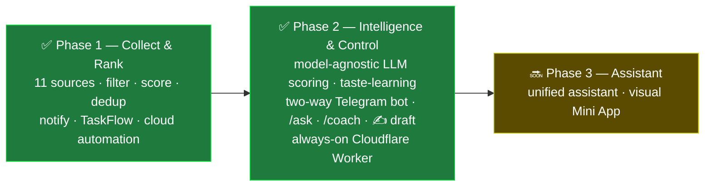

# Opportunity Hunter

> **Stop scrolling for opportunities. Make opportunities find you.**

Every day, the best hackathons, internships, fellowships, research, and coding contests get posted across a dozen platforms — and the good ones get missed simply because nobody can check them all. **Opportunity Hunter flips that around:** it scans everything for you, filters the noise, scores what's left by relevance and urgency **with an LLM that judges against *your* profile**, and delivers only the signal — then lets you **act on it with one tap** from a chat bot that runs 24/7 in the cloud.

```
   11 SOURCES               FILTER · LLM SCORE · TUNE            DELIVER + ACT
 ┌───────────────┐        ┌───────────────────────────┐      ┌──────────────────────┐
 │ ArXiv         │        │  relevance filter          │  ┌─▶│ 📱 Phone digest        │
 │ GitHub        │        │        ↓                   │  │  │   ntfy · Telegram      │
 │ Hacker News   │        │  LLM score (regret-aware,  │  │  └──────────────────────┘
 │ Devpost       │ ─────▶ │  model-agnostic) + rules   │──┤  ┌──────────────────────┐
 │ Devfolio      │  80–120│        ↓                   │  ├─▶│ 🤖 Telegram bot         │
 │ Reddit        │  items │  dedup · offload-aware tune │  │  │  tap · /ask · /coach   │
 │ clist · MLH   │  /run  │        ↓                   │  │  └──────────────────────┘
 │ Unstop        │        │  policy: notify / propose  │  │  ┌──────────────────────┐
 │ Programs ⭐   │        └───────────────────────────┘  └─▶│ ✅ TaskFlow (one tap)  │
 │ Internships ✓ │                                          └──────────────────────┘
 └───────────────┘
```

---

## The problem → the solution

Every ambitious student and developer faces the same problem: the best opportunities are scattered across a dozen platforms, and the good ones are missed simply because **nobody can check them all, every day, and judge which ones matter to them.** Manually scrolling Devpost, Devfolio, GitHub, Reddit, Hacker News, ArXiv, MLH, Unstop, and contest trackers is a losing game.

Opportunity Hunter inverts the model. It **scans them for you, filters the noise, ranks what's left by how much *you specifically* would regret missing it, and pushes only the signal** — then turns each opportunity into an action you can take with a single tap. The design tagline: *"Stop scrolling for opportunities. Make opportunities find you."*

## How it works

A modular Python pipeline built around a single normalized `Opportunity` data model. Source collectors (each isolated, so one failure never takes down the run) feed a keyword relevance filter, then an **LLM scorer that ranks each item against a personal profile**, then deduplication, then a policy layer that decides what to notify and what to propose. It runs **fully autonomously in the cloud via GitHub Actions on a daily schedule** — laptop-independent, with dedup state committed back to the repo so it resumes exactly where it left off.

Engineering deliberately handled real-world fragility: dead RSS feeds were swapped for JSON APIs, Reddit's datacenter-IP blocks were beaten with an RSS-first fallback, changed site markup was re-scraped resiliently, and aggregator listings are **independently verified** (dead links dropped) before they ever reach you.

```mermaid
flowchart LR
    subgraph S["🌐 11 Sources"]
        direction TB
        A1[ArXiv] & A2[GitHub] & A3[Hacker News]
        A4[Devpost] & A5[Devfolio] & A6[Reddit]
        A7[clist.by] & A8[MLH] & A9[Unstop]
        A10["Flagship Programs ⭐"] & A11["Internships (verified) ✓"]
    end
    S --> F["🔎 Relevance filter<br/>keyword match vs. profile"]
    F --> SC["🧠 LLM score 0–10<br/>regret-aware · model-agnostic<br/>(rule scorer as fallback)"]
    SC --> TU["🎚️ Offload-aware tune<br/>de-prioritise what you keep dropping"]
    TU --> D["🧹 Dedup<br/>native ID / canonical URL"]
    D --> P{"⚖️ Policy"}
    P -->|"propose"| TF["✅ TaskFlow task<br/>(you confirm with one tap)"]
    P -->|"notify"| N["📱 ntfy + 🤖 Telegram digest"]
    D --> B["🖥️ Rich daily brief"]
```



## The intelligence layer (Phase 2 — shipped)

**Model-agnostic LLM scoring.** Instead of asking *"is this an AI hackathon?"*, the scorer asks *"would this person regret missing this?"* — grading each opportunity on six weighted dimensions (career impact · interest · prestige · deadline urgency · skill growth · time cost) and returning a 0–10 score, a one-line *why it matters*, and a short action plan. It talks the **OpenAI-compatible chat format**, so it works with **any provider** — the shipped default chains **Groq → Cerebras → OpenRouter** (all free tiers) and falls through on quota/error. **With no API key at all, it cleanly falls back to the deterministic rule-based scorer** — nothing ever crashes, and the model-agnostic design means you're never locked to one vendor.

**Taste-learning.** The system watches which opportunities you act on versus skip and distils that into a *learned preferences* signal that feeds back into the scoring prompt — so the more you use it, the more it ranks like you. Fully explainable (`/taste` shows exactly what it concluded).

**Offload-aware scoring & consent.** Opportunity Hunter reads the task manager's behavioural signals *only with permission* (a live `permissions` gate), and de-prioritises categories you **repeatedly** drop or offload (a 2+ pattern, never a single dismissal) — with a visible *"↓ deprioritized — you've set down similar (#hackathon ×3)"* note.

## Two-way control — the Telegram bot

Discovery is only half the job; **acting** is the other half. Each opportunity in the digest carries inline buttons and the bot is fully conversational:

| Action | What it does |
| --- | --- |
| ➕ **Plan** | one tap turns the opportunity into a well-formed TaskFlow task (clean title, link, notes, deadline, tags) |
| ✅ **Applied** / ⏭ **Skip** / ⏰ **Remind** | tracks your status; skips stop the nagging; reminders resurface later |
| ✍️ **Draft** | generates a tailored, first-person *"why me"* application paragraph from your profile |
| 💬 **just ask it** | *"any AI internships closing this week?"* → a grounded answer over your live feed |
| 🧭 **/coach** | a career gap-analysis: what the elite programs you're seeing require that you don't have yet, and a concrete plan to close the gap — and it answers follow-up questions |
| 📊 **/report** | a weekly "regret report": what you applied to, skipped, and what's closing soon that you haven't acted on |

The bot is **deployed as an always-on [Cloudflare Worker](cloudflare-bot/)** (free, serverless, webhook-based) — so taps, drafts, and questions work **even when your computer is off**. It reads a compact `feed.json` from this repo and writes chosen tasks back through a file-based sync, keeping the whole loop laptop-independent. (It also runs locally via `telegram_listener.py`.)

## How an item is scored

The **rule-based scorer** (the always-available fallback, and the fast pre-filter) is additive, capped at 10:

| Signal | Points |
| --- | --- |
| Interest keyword in **title** | +3 |
| Interest keyword in **description** | +2 |
| Deadline within **7 days** | +3 |
| Deadline within **30 days** | +1 |
| Remote / online | +2 |
| Mentions student / intern | +1 |
| From a known company (Google, Microsoft, Anthropic, NVIDIA…) | +2 |
| Prize / stipend mentioned | +1 |

When an LLM key is present, the **multi-dimensional LLM score takes over** (the policy layer prefers it automatically); otherwise these rules run. Either way the scale is shared, so the tiers below always apply:

> **9–10** 🔥 act today · **7–8** ⚡ act this week · **5–6** 📌 review · **1–4** 📚 learning feed
>
> Deadlines drive urgency: real deadlines are parsed from the sources that carry them, and the **Deadline Radar** resurfaces flagship programs as their application windows open. Nothing is auto-added to your board — high-value items are **proposed**, and you confirm with one tap.

## Status & roadmap

**Phase 1 — Collect & Rank ✅ (shipped):** 11 sources live and proven in the cloud, relevance filtering, urgency scoring, deduplication, dual desktop/phone notifications, and injection-safe task-manager integration — all end to end.

**Phase 2 — Intelligence & Control ✅ (shipped):** model-agnostic LLM scoring (with rule-based fallback), taste-learning, offload-aware tuning + a permission gate, and a full **two-way Telegram bot** — inline-button actions, the conversational `/ask`, the `/coach` gap-analysis, ✍️ tap-to-draft, and `/report` — running always-on as a **Cloudflare Worker**.

**Phase 3 — Assistant 🔜 (next):** deeper integration into a unified assistant and a visual Telegram Mini App dashboard.



## Sources

| # | Source | What it surfaces | Access | Notes |
| --- | --- | --- | --- | --- |
| 1 | **ArXiv** | Latest AI / ML / NLP papers | Atom API | Rock-solid, no auth |
| 2 | **GitHub** | Trending AI/ML repos (recent + high-star) | REST Search API | Token lifts rate limit |
| 3 | **Hacker News** | Top tech stories | Firebase API | Concurrent fetch |
| 4 | **Devpost** | Global hackathons | JSON API | Real deadlines + prizes |
| 5 | **Devfolio** | Hackathons (India-heavy) | JSON API | Real deadlines, India-focused |
| 6 | **Reddit** | r/MachineLearning · r/developersIndia | RSS-first | Beats datacenter-IP 403s |
| 7 | **clist.by** | Competitive-programming contests | API v4 | Free key required |
| 8 | **MLH** | Major League Hacking events | Resilient HTML scrape | Re-scraped after markup change |
| 9 | **Unstop** | Hackathons · internships · scholarships (India) | JSON API | India-focused |
| 10 | **Flagship Programs** ⭐ | Curated elite programs (GSoC, Outreachy, MLH Fellowship, Amazon ML School, Google/Microsoft/NVIDIA…) | Curated watchlist + Deadline Radar | Never goes stale; LLM ranks them |
| 11 | **Internships** ✓ | AI/ML/SWE internships aggregator | SimplifyJobs feed + independent liveness verifier | Dead links dropped before they reach you |

Each source is one `fetch()` function registered in [`sources/`](sources/) and wrapped so a single failure never crashes the run — **adding a new source is one file plus one registry line.**

## Quick Start

```bash
# 1. Clone
git clone https://github.com/Mohith535/opportunity-hunter.git
cd opportunity-hunter

# 2. Configure (copy the template, then fill in your own values)
cp .env.example .env

# 3. Install
pip install -r requirements.txt

# 4. Dry run (no notifications, no task writes)
python main.py --test

# 5. Real run (sends the digest; proposes high-value items you confirm with a tap)
python main.py --now
```

**CLI flags:** `--now` run once · `--test` dry run · `--sources arxiv,devfolio` run a subset · `--recap` re-show the last brief · *(no flag)* start the daily 08:00 scheduler.

**Configuration (all optional, names only — never commit real values):**
- `NTFY_TOPIC` — your private ntfy.sh topic for phone push.
- `GROQ_API_KEY` / `CEREBRAS_API_KEY` / `OPENROUTER_API_KEY` — any one enables LLM scoring (free tiers). With none set, the rule-based scorer runs.
- `CLIST_USERNAME` / `CLIST_API_KEY` — free key for the contests source.
- `TELEGRAM_BOT_TOKEN` / `TELEGRAM_CHAT_ID` — for the interactive Telegram digest + bot.

**Run it in the cloud:** the included [GitHub Actions workflow](.github/workflows/daily.yml) runs the hunt daily at 08:00 IST, sends the digest, and commits dedup state back so it never repeats itself — fully laptop-independent. Add the keys above as **repository secrets**.

**Deploy the always-on bot:** see [`cloudflare-bot/README.md`](cloudflare-bot/) — a free Cloudflare Worker that handles taps, `/ask`, `/coach`, and drafts 24/7 with no PC.

## Notifications

Phone alerts use **[ntfy.sh](https://ntfy.sh)** (free, no account) and/or the **Telegram bot** (free, interactive):

1. **ntfy:** install the app, subscribe to your private `NTFY_TOPIC` — done.
2. **Telegram:** create a bot with `@BotFather`, set `TELEGRAM_BOT_TOKEN` / `TELEGRAM_CHAT_ID`, and (optionally) deploy the Cloudflare Worker for always-on control.

## Privacy & consent

Local-first by design. Behavioural signals from the task manager are read **only through a live permission gate** and used solely to tune *your* ranking; raw personal data stays on your machine, and secrets are read from the environment / `.env` (git-ignored) — **never committed.**

## Contributing

Adding a new source takes one file + one registry line. PRs welcome.

---

*Built file-by-file, tested at each step, and proven running autonomously in the cloud.*
