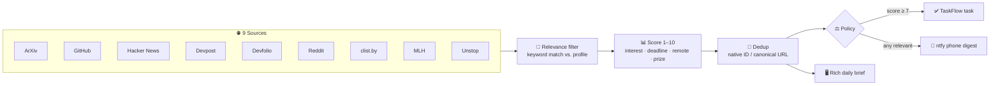
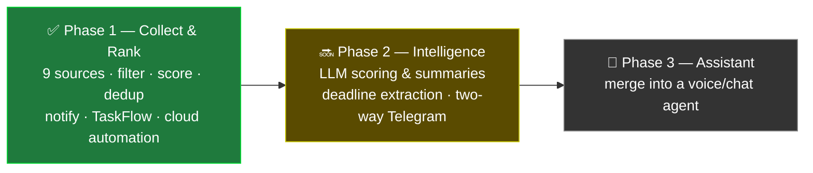

# Opportunity Hunter

> **Stop scrolling for opportunities. Make opportunities find you.**

Every day, the best hackathons, internships, fellowships, research, and coding contests get posted across a dozen platforms — and the good ones get missed simply because nobody can check them all. **Opportunity Hunter flips that around:** it scans everything for you, filters the noise, scores what's left by relevance and urgency, and pushes only the signal to your phone — automatically, every day, in the cloud.

```
   9 SOURCES                FILTER · SCORE · DEDUP              DELIVER
 ┌───────────┐            ┌──────────────────────┐         ┌──────────────┐
 │ ArXiv     │            │  relevance filter     │    ┌───▶│ 📱 Phone push │
 │ GitHub    │            │        ↓              │    │    │   (ntfy.sh)   │
 │ HackerNews│   ───────▶ │  score 1–10           │ ───┤    └──────────────┘
 │ Devpost   │   80–120   │        ↓              │    │    ┌──────────────┐
 │ Devfolio  │   items/   │  dedup (never twice)  │    ├───▶│ ✅ TaskFlow   │
 │ Reddit    │    run     │        ↓              │    │    │   (score ≥ 7) │
 │ clist.by  │            │  policy: notify/dump  │    │    └──────────────┘
 │ MLH       │            │                       │    │    ┌──────────────┐
 │ Unstop    │            │                       │    └───▶│ 🖥️ Daily Brief│
 └───────────┘            └──────────────────────┘         └──────────────┘
```

---

## What it does

Opportunity Hunter is an automated opportunity-discovery agent that solves a problem every ambitious student and developer faces: the best hackathons, internships, fellowships, research, and contests are scattered across a dozen platforms, and the good ones are missed simply because nobody can check them all every day. Instead of manually scrolling through Devpost, Devfolio, GitHub, Reddit, Hacker News, ArXiv, MLH, Unstop, and contest trackers, Opportunity Hunter inverts the model — it scans them for you, filters out the noise, ranks what's left by relevance and urgency, and pushes only the signal to your phone. The tagline that drove the design: *"Stop scrolling for opportunities. Make opportunities find you."*

## How it works

Technically, it's a modular Python pipeline built around a single normalized data model. Nine source collectors (each isolated so one failure never takes down the run) feed into a keyword-based relevance filter and a rule-based 1–10 scorer that weighs interest match, deadline proximity, remote/online availability, and prize/stipend signals. High-value, deadline-bearing items are auto-captured into a personal CLI task manager (TaskFlow) via an injection-safe integration, while a per-source digest is delivered to the phone through ntfy.sh. Deduplication (using source-native IDs and canonicalized URLs) ensures the same opportunity is never reported twice. The entire system runs **fully autonomously in the cloud via GitHub Actions on a daily schedule** — laptop-independent, with dedup state persisted back to the repository so it picks up exactly where it left off. Engineering deliberately handled real-world fragility: dead RSS feeds were swapped for JSON APIs, Reddit's datacenter-IP blocks were beaten with an RSS-first fallback, and changed site markup was re-scraped resiliently.



**How an item is scored** (additive, capped at 10):

| Signal | Points |
| --- | --- |
| Interest keyword in **title** | +3 |
| Interest keyword in **description** | +2 |
| Deadline within **7 days** | +3 |
| Deadline within **30 days** | +1 |
| Remote / online | +2 |
| Mentions student / intern | +1 |
| From a known company (Google, Microsoft, Anthropic, NVIDIA…) | +2 |
| Prize / stipend mentioned | +1 |

> **9–10** 🔥 act today · **7–8** ⚡ act this week (auto-added to TaskFlow) · **5–6** 📌 review · **1–4** 📚 learning feed

## Status

**Status: Phase 1 is complete** — all nine sources are live and proven running in the cloud, with relevance filtering, urgency scoring, deduplication, dual desktop/phone notifications, and task-manager integration all working end to end. **Phase 2 (planned)** introduces an intelligence layer: replacing the rule-based scorer with LLM-powered relevance scoring and summarization (the integration points are already stubbed in), extracting deadlines from unstructured text, and adding two-way Telegram control so the agent can ask "add this to your task list? yes/no" and act on the reply.



## Quick Start

```bash
# 1. Clone
git clone https://github.com/Mohith535/opportunity-hunter.git
cd opportunity-hunter

# 2. Configure secrets
cp .env.example .env          # then edit .env and fill in your keys

# 3. Install
pip install -r requirements.txt

# 4. Dry run (no notifications, no TaskFlow dumps)
python main.py --test

# 5. Real run (sends phone digest + auto-adds high-score items to TaskFlow)
python main.py --now
```

**CLI flags:** `--now` run once · `--test` dry run · `--sources arxiv,devfolio` run a subset · `--recap` re-show the last brief · *(no flag)* start the daily 08:00 scheduler.

**Run it in the cloud:** the included [GitHub Actions workflow](.github/workflows/daily.yml) runs the hunt every day at 08:00 IST, sends the phone digest, and commits dedup state back so it never repeats itself — fully laptop-independent. Add `NTFY_TOPIC`, `CLIST_USERNAME`, and `CLIST_API_KEY` as repository secrets.

## Sources

| # | Source | What it surfaces | Access | Notes |
| --- | --- | --- | --- | --- |
| 1 | **ArXiv** | Latest AI / ML / NLP papers | Atom API | Rock-solid, no auth |
| 2 | **GitHub** | Trending AI/ML repos (recent + high-star) | REST Search API | No auth (60 req/hr) |
| 3 | **Hacker News** | Top tech stories | Firebase API | Concurrent fetch |
| 4 | **Devpost** | Global hackathons | JSON API | Real deadlines + prizes |
| 5 | **Devfolio** | Hackathons (India-heavy) | JSON API | Real deadlines, India-focused |
| 6 | **Reddit** | r/MachineLearning · r/developersIndia | RSS-first | Beats datacenter-IP 403s |
| 7 | **clist.by** | Competitive-programming contests | API v4 | Free key required |
| 8 | **MLH** | Major League Hacking events | Resilient HTML scrape | Re-scraped after markup change |
| 9 | **Unstop** | Hackathons / internships (India) | JSON API | India-focused |

Each source is one `fetch()` function registered in [`sources/`](sources/) and wrapped so a single failure never crashes the run.

## Notifications

Phone alerts use **[ntfy.sh](https://ntfy.sh)** — free, no account:

1. Install the **ntfy** app (Android / iOS).
2. Subscribe to your private topic (the value of `NTFY_TOPIC` in your `.env`) — done.

## Contributing

Adding a new source takes one file + one registry line. PRs welcome.

---

*Built file-by-file, tested at each step, and proven running autonomously in the cloud.*
